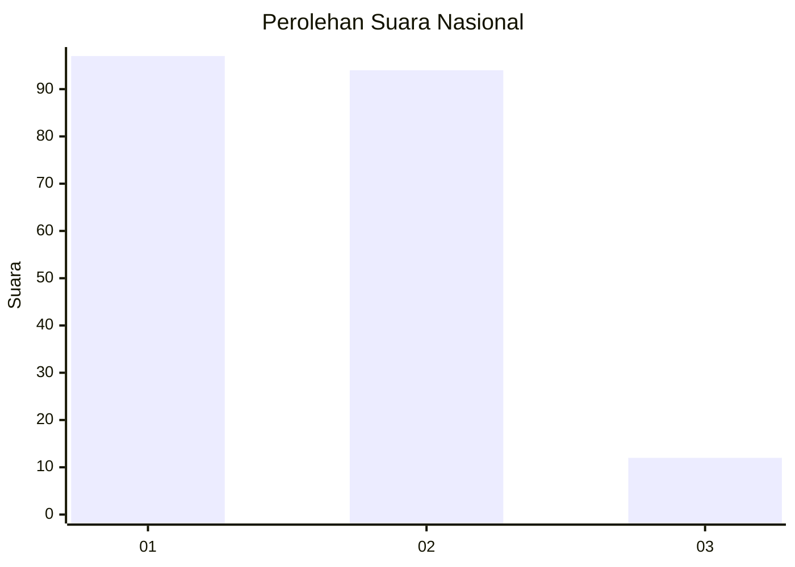
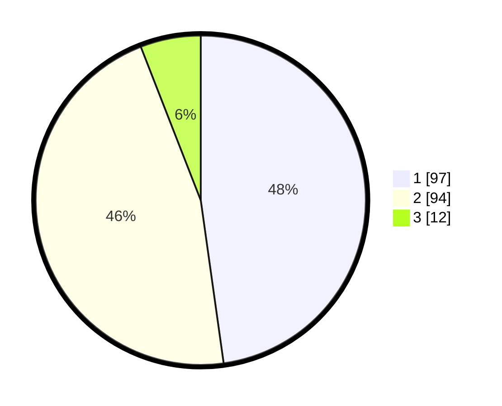

# Hasil

## Grafik

## Tabel

| No. | Nama Paslon    | Suara | Suara (raw) | Persentase |
|:--- |:-------------- | -----:| -----------:| ----------:|
| 1   | ANIES MUHAIMIN | 97    | [97][p-1]   | 47,78      |
| 2   | PRABOWO GIBRAN | 94    | [94][p-2]   | 46,31      |
| 3   | GANJAR MAHFUD  | 12    | [12][p-3]   | 5,91       |

[p-1]: https://github.com/gigit-pemilu/pemilu-2024/blob/main/pilpres/hitung-suara/sub/61-kalimantan-barat/sub/72-kota-singkawang/sub/01-singkawang-tengah/sub/1001-roban/sub/004-tps/sub/paslon-1.txt
[p-2]: https://github.com/gigit-pemilu/pemilu-2024/blob/main/pilpres/hitung-suara/sub/61-kalimantan-barat/sub/72-kota-singkawang/sub/01-singkawang-tengah/sub/1001-roban/sub/004-tps/sub/paslon-2.txt
[p-3]: https://github.com/gigit-pemilu/pemilu-2024/blob/main/pilpres/hitung-suara/sub/61-kalimantan-barat/sub/72-kota-singkawang/sub/01-singkawang-tengah/sub/1001-roban/sub/004-tps/sub/paslon-3.txt

## Foto C Plano

https://sirekap-obj-formc.kpu.go.id/bfa5/pemilu/ppwp/61/72/01/10/01/6172011001004-20240214-221820--e8b43afe-b1d7-440b-9dbe-6f11ac277a1f.jpg

https://sirekap-obj-formc.kpu.go.id/bfa5/pemilu/ppwp/61/72/01/10/01/6172011001004-20240214-221839--ab13b4d1-04ae-4176-9aab-36e80eff0137.jpg

https://sirekap-obj-formc.kpu.go.id/bfa5/pemilu/ppwp/61/72/01/10/01/6172011001004-20240214-221855--ecb99390-55a5-48de-8ee1-95050549e34b.jpg

## Metadata

| Key        | Value               |
| ---------- | ------------------- |
| Time Stamp | 2024-02-25 15:00:00 |

