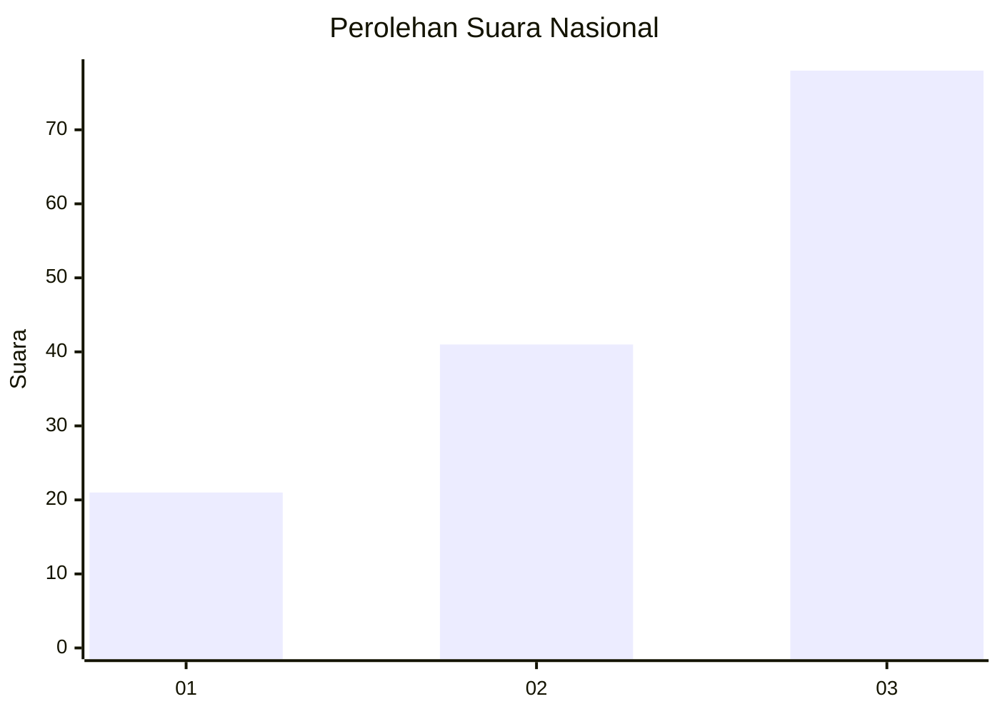
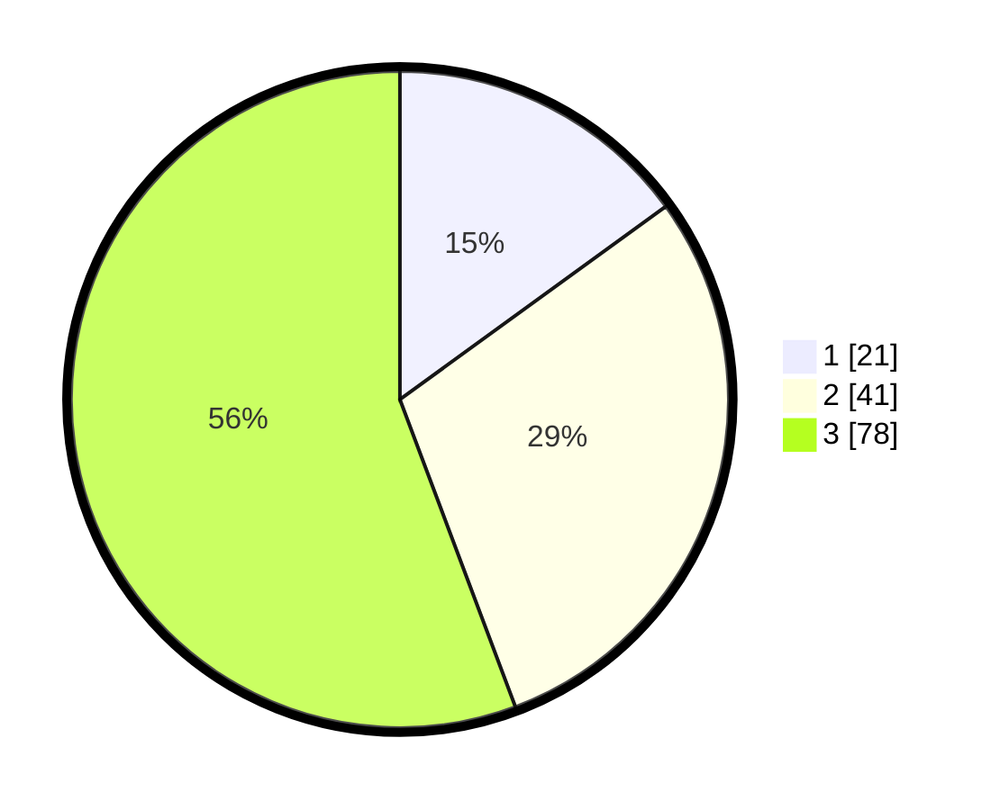

# Hasil

## Grafik

## Tabel

| No. | Nama Paslon    | Suara | Suara (raw) | Persentase |
|:--- |:-------------- | -----:| -----------:| ----------:|
| 1   | ANIES MUHAIMIN | 21    | [21][p-1]   | 15,00      |
| 2   | PRABOWO GIBRAN | 41    | [41][p-2]   | 29,29      |
| 3   | GANJAR MAHFUD  | 78    | [78][p-3]   | 55,71      |

[p-1]: https://github.com/gigit-pemilu/pemilu-2024/blob/main/pilpres/hitung-suara/sub/61-kalimantan-barat/sub/72-kota-singkawang/sub/01-singkawang-tengah/sub/1001-roban/sub/057-tps/sub/paslon-1.txt
[p-2]: https://github.com/gigit-pemilu/pemilu-2024/blob/main/pilpres/hitung-suara/sub/61-kalimantan-barat/sub/72-kota-singkawang/sub/01-singkawang-tengah/sub/1001-roban/sub/057-tps/sub/paslon-2.txt
[p-3]: https://github.com/gigit-pemilu/pemilu-2024/blob/main/pilpres/hitung-suara/sub/61-kalimantan-barat/sub/72-kota-singkawang/sub/01-singkawang-tengah/sub/1001-roban/sub/057-tps/sub/paslon-3.txt

## Foto C Plano

https://sirekap-obj-formc.kpu.go.id/16bd/pemilu/ppwp/61/72/01/10/01/6172011001057-20240226-230407--f297c029-ddf3-45e4-be0d-049ccdf151b1.jpg

https://sirekap-obj-formc.kpu.go.id/16bd/pemilu/ppwp/61/72/01/10/01/6172011001057-20240214-162250--265b1b57-2f3f-4184-94d0-2047dc8aa8f0.jpg

https://sirekap-obj-formc.kpu.go.id/16bd/pemilu/ppwp/61/72/01/10/01/6172011001057-20240214-162454--95230433-edcb-4157-9ca1-65b57f5d80d2.jpg

## Metadata

| Key        | Value               |
| ---------- | ------------------- |
| Time Stamp | 2024-02-27 00:00:00 |

