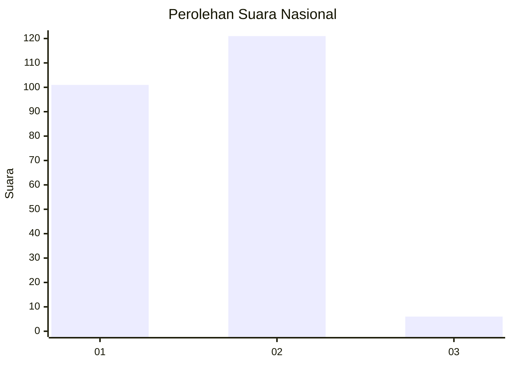
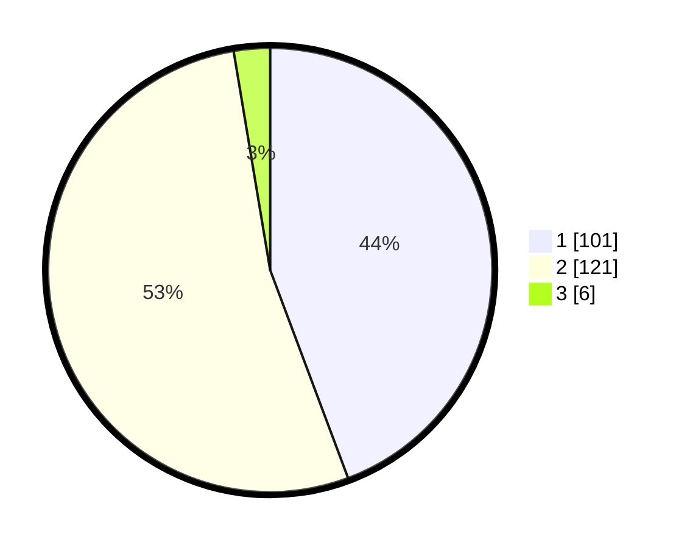

# Hasil

## Grafik

## Tabel

| No. | Nama Paslon    | Suara | Suara (raw) | Persentase |
|:--- |:-------------- | -----:| -----------:| ----------:|
| 1   | ANIES MUHAIMIN | 101   | [101][p-1]  | 44,30      |
| 2   | PRABOWO GIBRAN | 121   | [121][p-2]  | 53,07      |
| 3   | GANJAR MAHFUD  | 6     | [6][p-3]    | 2,63       |

[p-1]: https://github.com/gigit-pemilu/pemilu-2024/blob/main/pilpres/hitung-suara/sub/61-kalimantan-barat/sub/72-kota-singkawang/sub/01-singkawang-tengah/sub/1001-roban/sub/093-tps/sub/paslon-1.txt
[p-2]: https://github.com/gigit-pemilu/pemilu-2024/blob/main/pilpres/hitung-suara/sub/61-kalimantan-barat/sub/72-kota-singkawang/sub/01-singkawang-tengah/sub/1001-roban/sub/093-tps/sub/paslon-2.txt
[p-3]: https://github.com/gigit-pemilu/pemilu-2024/blob/main/pilpres/hitung-suara/sub/61-kalimantan-barat/sub/72-kota-singkawang/sub/01-singkawang-tengah/sub/1001-roban/sub/093-tps/sub/paslon-3.txt

## Foto C Plano

https://sirekap-obj-formc.kpu.go.id/53bd/pemilu/ppwp/61/72/01/10/01/6172011001093-20240225-144540--3f372f84-2bd2-43e9-afe0-2e65e5f043fd.jpg

https://sirekap-obj-formc.kpu.go.id/53bd/pemilu/ppwp/61/72/01/10/01/6172011001093-20240225-144558--a018d659-3b67-4902-b81c-f062983c5783.jpg

https://sirekap-obj-formc.kpu.go.id/53bd/pemilu/ppwp/61/72/01/10/01/6172011001093-20240225-144638--dc658e56-9587-407c-a535-eeeba07d5ebc.jpg

## Metadata

| Key        | Value               |
| ---------- | ------------------- |
| Time Stamp | 2024-02-25 17:00:00 |

## DATA PEMILIH TETAP

Jumlah pemilih dalam DPT: **273**.
 * L: **780**.
 * P: **133**.

## DATA PENGGUNA HAK PILIH

Jumlah pengguna hak pilih dalam DPT: **369**.
 * L: **95**.
 * P: **419**.

Jumlah pengguna hak pilih dalam DPTb: **80**.
 * L: **808**.
 * P: **880**.

Jumlah pengguna hak pilih dalam DPK: **809**.
 * L: **805**.
 * P: **889**.

Jumlah pengguna hak pilih: **328**.
 * L: **330**.
 * P: **420**.

## JUMLAH SUARA SAH DAN TIDAK SAH

JUMLAH SELURUH SUARA SAH: **228**.

JUMLAH SUARA TIDAK SAH: **0**.

JUMLAH SELURUH SUARA SAH DAN SUARA TIDAK SAH: **228**.

