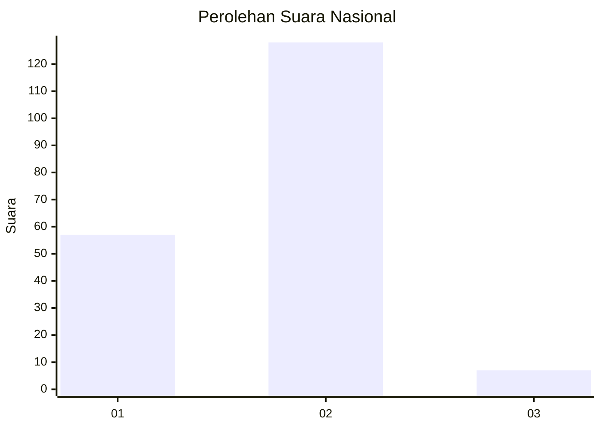
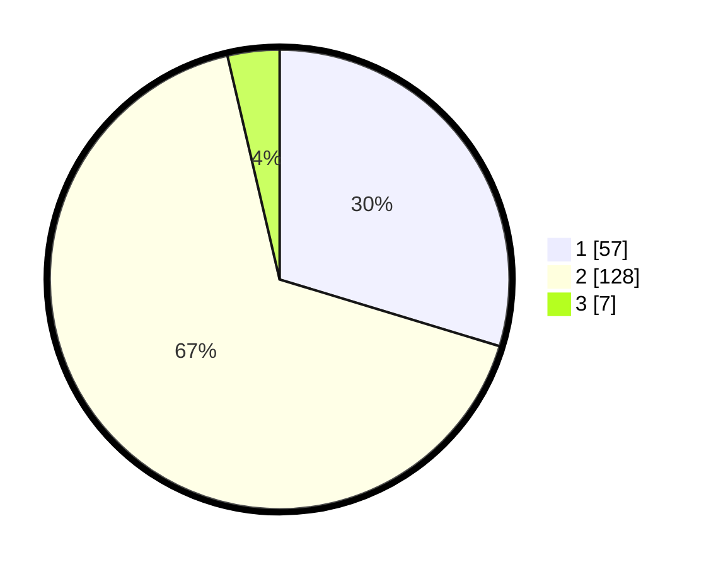

# Hasil

## Grafik

## Tabel

| No. | Nama Paslon    | Suara | Suara (raw) | Persentase |
|:--- |:-------------- | -----:| -----------:| ----------:|
| 1   | ANIES MUHAIMIN | 57    | [57][p-1]   | 29,69      |
| 2   | PRABOWO GIBRAN | 128   | [128][p-2]  | 66,67      |
| 3   | GANJAR MAHFUD  | 7     | [7][p-3]    | 3,65       |

[p-1]: https://github.com/gigit-pemilu/pemilu-2024/blob/main/pilpres/hitung-suara/sub/61-kalimantan-barat/sub/72-kota-singkawang/sub/01-singkawang-tengah/sub/1002-condong/sub/003-tps/sub/paslon-1.txt
[p-2]: https://github.com/gigit-pemilu/pemilu-2024/blob/main/pilpres/hitung-suara/sub/61-kalimantan-barat/sub/72-kota-singkawang/sub/01-singkawang-tengah/sub/1002-condong/sub/003-tps/sub/paslon-2.txt
[p-3]: https://github.com/gigit-pemilu/pemilu-2024/blob/main/pilpres/hitung-suara/sub/61-kalimantan-barat/sub/72-kota-singkawang/sub/01-singkawang-tengah/sub/1002-condong/sub/003-tps/sub/paslon-3.txt

## Foto C Plano

https://sirekap-obj-formc.kpu.go.id/797d/pemilu/ppwp/61/72/01/10/02/6172011002003-20240222-212137--e8f53f39-7684-4186-a485-8276362bd8cf.jpg

https://sirekap-obj-formc.kpu.go.id/797d/pemilu/ppwp/61/72/01/10/02/6172011002003-20240222-212214--257b4218-c9b2-4f9f-ab57-3f6fcb1d2641.jpg

https://sirekap-obj-formc.kpu.go.id/797d/pemilu/ppwp/61/72/01/10/02/6172011002003-20240222-212337--ba3c7d72-aabe-4050-b237-731baf27c992.jpg

## Metadata

| Key        | Value               |
| ---------- | ------------------- |
| Time Stamp | 2024-02-22 22:00:00 |

## DATA PEMILIH TETAP

Jumlah pemilih dalam DPT: **280**.
 * L: **232**.
 * P: **332**.

## DATA PENGGUNA HAK PILIH

Jumlah pengguna hak pilih dalam DPT: **202**.
 * L: **495**.
 * P: **759**.

Jumlah pengguna hak pilih dalam DPTb: **1**.
 * L: **800**.
 * P: **2**.

Jumlah pengguna hak pilih dalam DPK: **885**.
 * L: **302**.
 * P: **883**.

Jumlah pengguna hak pilih: **255**.
 * L: **420**.
 * P: **308**.

## JUMLAH SUARA SAH DAN TIDAK SAH

JUMLAH SELURUH SUARA SAH: **253**.

JUMLAH SUARA TIDAK SAH: **635**.

JUMLAH SELURUH SUARA SAH DAN SUARA TIDAK SAH: **203**.

