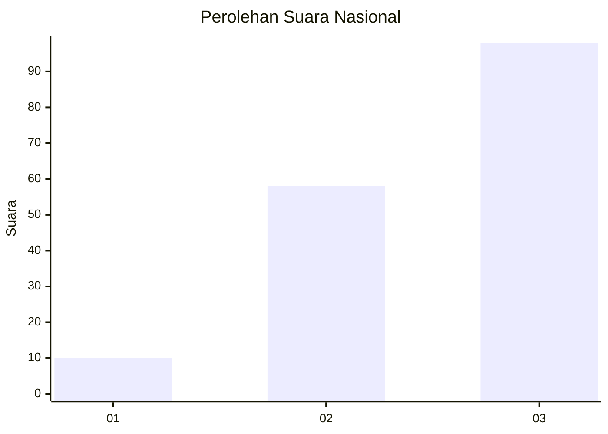
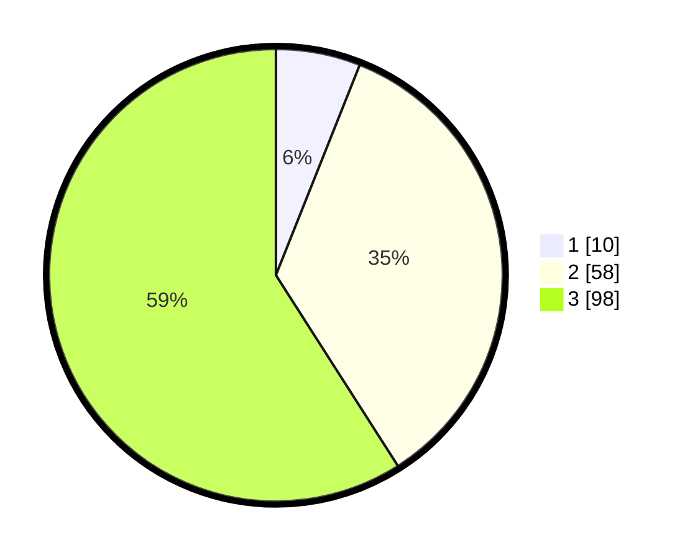

# Hasil

## Grafik

## Tabel

| No. | Nama Paslon    | Suara | Suara (raw) | Persentase |
|:--- |:-------------- | -----:| -----------:| ----------:|
| 1   | ANIES MUHAIMIN | 10    | [10][p-1]   | 6,02       |
| 2   | PRABOWO GIBRAN | 58    | [58][p-2]   | 34,94      |
| 3   | GANJAR MAHFUD  | 98    | [98][p-3]   | 59,04      |

[p-1]: https://github.com/gigit-pemilu/pemilu-2024/blob/main/pilpres/hitung-suara/sub/61-kalimantan-barat/sub/72-kota-singkawang/sub/01-singkawang-tengah/sub/1002-condong/sub/020-tps/sub/paslon-1.txt
[p-2]: https://github.com/gigit-pemilu/pemilu-2024/blob/main/pilpres/hitung-suara/sub/61-kalimantan-barat/sub/72-kota-singkawang/sub/01-singkawang-tengah/sub/1002-condong/sub/020-tps/sub/paslon-2.txt
[p-3]: https://github.com/gigit-pemilu/pemilu-2024/blob/main/pilpres/hitung-suara/sub/61-kalimantan-barat/sub/72-kota-singkawang/sub/01-singkawang-tengah/sub/1002-condong/sub/020-tps/sub/paslon-3.txt

## Foto C Plano

https://sirekap-obj-formc.kpu.go.id/96ea/pemilu/ppwp/61/72/01/10/02/6172011002020-20240224-141444--1e043e3d-9148-4d4e-a056-ca008f070d93.jpg

https://sirekap-obj-formc.kpu.go.id/96ea/pemilu/ppwp/61/72/01/10/02/6172011002020-20240224-141559--cbffae86-0451-4553-9457-00bb8f28441b.jpg

https://sirekap-obj-formc.kpu.go.id/96ea/pemilu/ppwp/61/72/01/10/02/6172011002020-20240224-141633--b64f9eb4-54c6-4d7e-860a-300f4c048958.jpg

## Metadata

| Key        | Value               |
| ---------- | ------------------- |
| Time Stamp | 2024-02-24 22:31:28 |

## DATA PEMILIH TETAP

Jumlah pemilih dalam DPT: **273**.
 * L: **736**.
 * P: **237**.

## DATA PENGGUNA HAK PILIH

Jumlah pengguna hak pilih dalam DPT: **775**.
 * L: **777**.
 * P: **777**.

Jumlah pengguna hak pilih dalam DPTb: **20**.
 * L: **7**.
 * P: **3**.

Jumlah pengguna hak pilih dalam DPK: **702**.
 * L: **2**.
 * P: **40**.

Jumlah pengguna hak pilih: **266**.
 * L: **88**.
 * P: **79**.

## JUMLAH SUARA SAH DAN TIDAK SAH

JUMLAH SELURUH SUARA SAH: **166**.

JUMLAH SUARA TIDAK SAH: **0**.

JUMLAH SELURUH SUARA SAH DAN SUARA TIDAK SAH: **166**.

