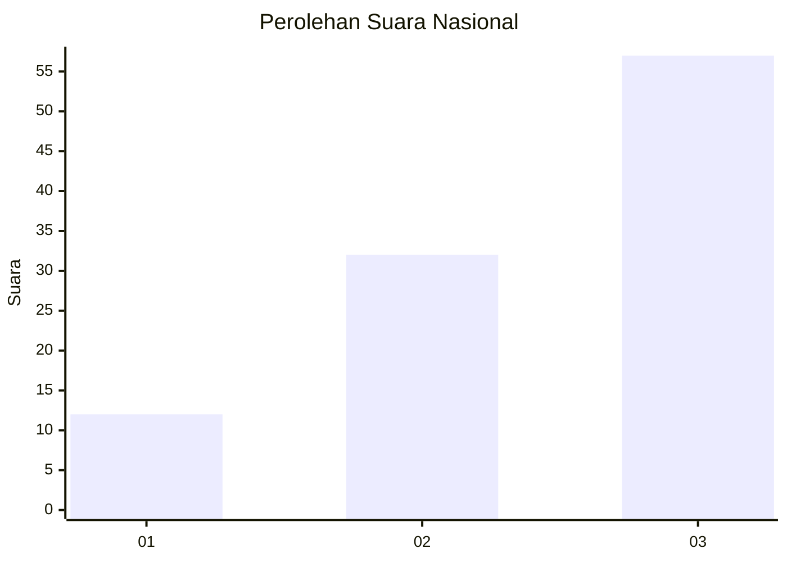
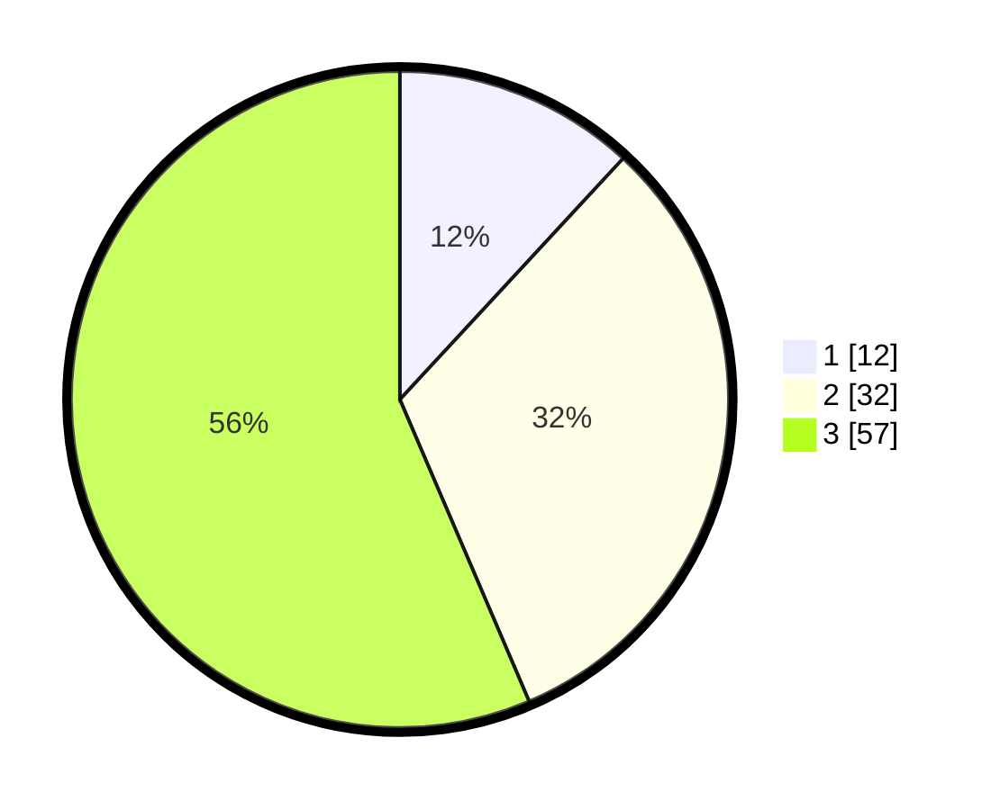

# Hasil

## Grafik

## Tabel

| No. | Nama Paslon    | Suara | Suara (raw) | Persentase |
|:--- |:-------------- | -----:| -----------:| ----------:|
| 1   | ANIES MUHAIMIN | 12    | [12][p-1]   | 11,88      |
| 2   | PRABOWO GIBRAN | 32    | [32][p-2]   | 31,68      |
| 3   | GANJAR MAHFUD  | 57    | [57][p-3]   | 56,44      |

[p-1]: https://github.com/gigit-pemilu/pemilu-2024/blob/main/pilpres/hitung-suara/sub/61-kalimantan-barat/sub/72-kota-singkawang/sub/01-singkawang-tengah/sub/1002-condong/sub/024-tps/sub/paslon-1.txt
[p-2]: https://github.com/gigit-pemilu/pemilu-2024/blob/main/pilpres/hitung-suara/sub/61-kalimantan-barat/sub/72-kota-singkawang/sub/01-singkawang-tengah/sub/1002-condong/sub/024-tps/sub/paslon-2.txt
[p-3]: https://github.com/gigit-pemilu/pemilu-2024/blob/main/pilpres/hitung-suara/sub/61-kalimantan-barat/sub/72-kota-singkawang/sub/01-singkawang-tengah/sub/1002-condong/sub/024-tps/sub/paslon-3.txt

## Foto C Plano

https://sirekap-obj-formc.kpu.go.id/858d/pemilu/ppwp/61/72/01/10/02/6172011002024-20240224-155905--dd6d32e5-d278-4ce4-b790-d7f5c4b76be7.jpg

https://sirekap-obj-formc.kpu.go.id/858d/pemilu/ppwp/61/72/01/10/02/6172011002024-20240224-155920--f9599865-4f20-4e27-af39-d45c91f4721d.jpg

https://sirekap-obj-formc.kpu.go.id/858d/pemilu/ppwp/61/72/01/10/02/6172011002024-20240224-155939--156743f4-7d0e-4248-acd3-a2197eef04b1.jpg

## Metadata

| Key        | Value               |
| ---------- | ------------------- |
| Time Stamp | 2024-02-24 22:31:28 |

## DATA PEMILIH TETAP

Jumlah pemilih dalam DPT: **181**.
 * L: **86**.
 * P: **875**.

## DATA PENGGUNA HAK PILIH

Jumlah pengguna hak pilih dalam DPT: **599**.
 * L: **448**.
 * P: **46**.

Jumlah pengguna hak pilih dalam DPTb: **7**.
 * L: **444**.
 * P: **3**.

Jumlah pengguna hak pilih dalam DPK: **1**.
 * L: **441**.
 * P: **800**.

Jumlah pengguna hak pilih: **102**.
 * L: **53**.
 * P: **449**.

## JUMLAH SUARA SAH DAN TIDAK SAH

JUMLAH SELURUH SUARA SAH: **101**.

JUMLAH SUARA TIDAK SAH: **1**.

JUMLAH SELURUH SUARA SAH DAN SUARA TIDAK SAH: **102**.

