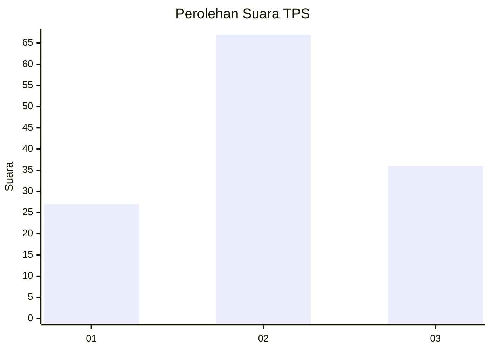
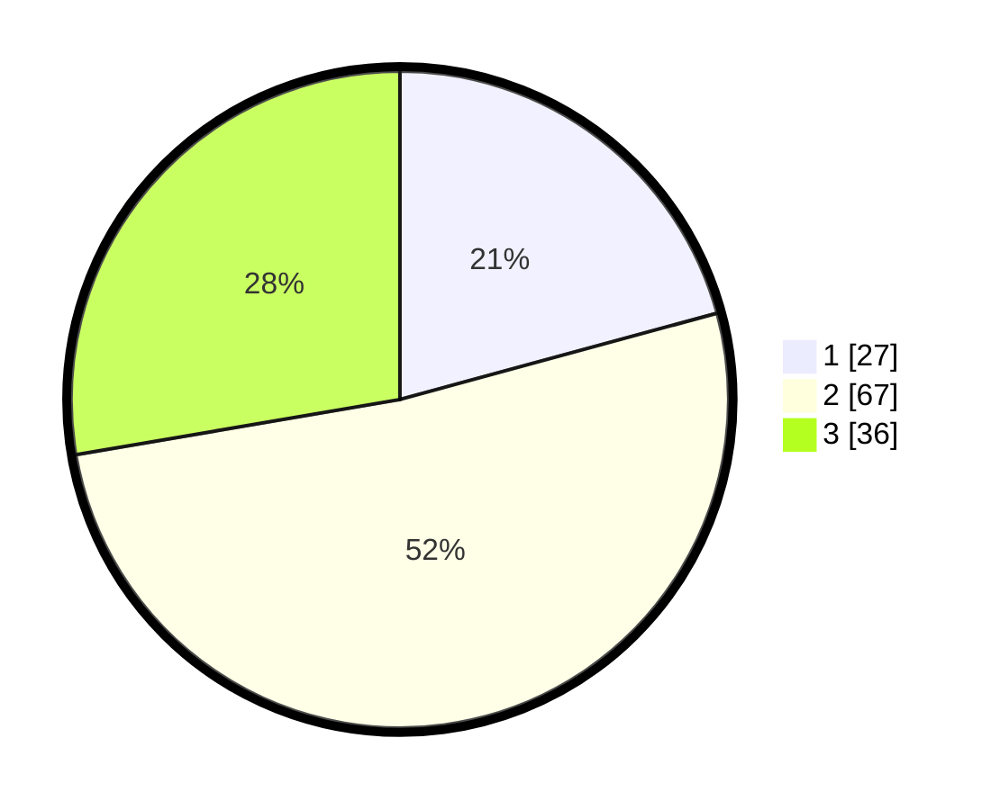

# Hasil

## Grafik

## Tabel

| No. | Nama Paslon    | Suara | Suara (raw) | Persentase |
|:--- |:-------------- | -----:| -----------:| ----------:|
| 1   | ANIES MUHAIMIN | 27    | [27][p-1]   | 20,77      |
| 2   | PRABOWO GIBRAN | 67    | [67][p-2]   | 51,54      |
| 3   | GANJAR MAHFUD  | 36    | [36][p-3]   | 27,69      |

[p-1]: https://github.com/gigit-pemilu/pemilu-2024-61-kalimantan-barat/blob/main/pilpres/hitung-suara/sub/61-kalimantan-barat/sub/72-kota-singkawang/sub/01-singkawang-tengah/sub/1002-condong/sub/025-tps/sub/paslon-1.txt
[p-2]: https://github.com/gigit-pemilu/pemilu-2024-61-kalimantan-barat/blob/main/pilpres/hitung-suara/sub/61-kalimantan-barat/sub/72-kota-singkawang/sub/01-singkawang-tengah/sub/1002-condong/sub/025-tps/sub/paslon-2.txt
[p-3]: https://github.com/gigit-pemilu/pemilu-2024-61-kalimantan-barat/blob/main/pilpres/hitung-suara/sub/61-kalimantan-barat/sub/72-kota-singkawang/sub/01-singkawang-tengah/sub/1002-condong/sub/025-tps/sub/paslon-3.txt

## Foto C Plano

https://sirekap-obj-formc.kpu.go.id/1726/pemilu/ppwp/61/72/01/10/02/6172011002025-20240224-195658--194ecf83-a424-4156-9a50-115b52c7dc56.jpg

https://sirekap-obj-formc.kpu.go.id/1726/pemilu/ppwp/61/72/01/10/02/6172011002025-20240224-195731--1a575589-7ed9-44ae-a261-2e72b17dc631.jpg

https://sirekap-obj-formc.kpu.go.id/1726/pemilu/ppwp/61/72/01/10/02/6172011002025-20240224-195812--0e1d2f0e-18d6-4d15-8d93-829626922a2c.jpg

## Metadata

| Key        | Value               |
| ---------- | ------------------- |
| Time Stamp | 2024-02-24 22:31:28 |

## DATA PEMILIH TETAP

Jumlah pemilih dalam DPT: **733**.
 * L: **135**.
 * P: **123**.

## DATA PENGGUNA HAK PILIH

Jumlah pengguna hak pilih dalam DPT: **122**.
 * L: **863**.
 * P: **859**.

Jumlah pengguna hak pilih dalam DPTb: **53**.
 * L: **22**.
 * P: **1**.

Jumlah pengguna hak pilih dalam DPK: **41**.
 * L: **801**.
 * P: **88**.

Jumlah pengguna hak pilih: **126**.
 * L: **66**.
 * P: **60**.

## JUMLAH SUARA SAH DAN TIDAK SAH

JUMLAH SELURUH SUARA SAH: **126**.

JUMLAH SUARA TIDAK SAH: **4**.

JUMLAH SELURUH SUARA SAH DAN SUARA TIDAK SAH: **50**.

