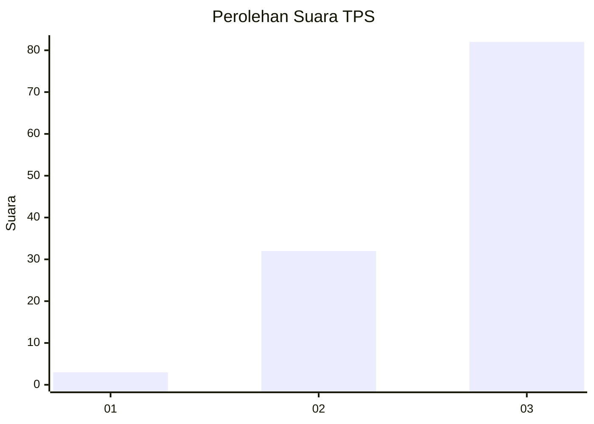
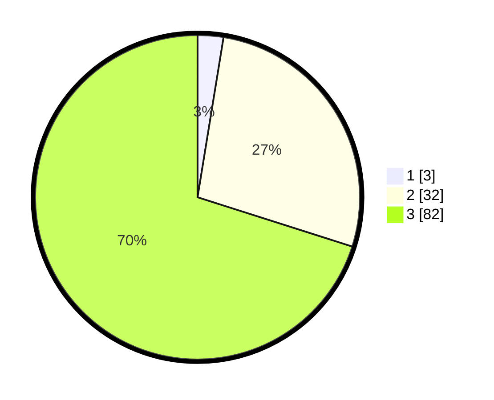

# Hasil

## Grafik

## Tabel

| No. | Nama Paslon    | Suara | Suara (raw) | Persentase |
|:--- |:-------------- | -----:| -----------:| ----------:|
| 1   | ANIES MUHAIMIN | 3     | [3][p-1]    | 2,56       |
| 2   | PRABOWO GIBRAN | 32    | [32][p-2]   | 27,35      |
| 3   | GANJAR MAHFUD  | 82    | [82][p-3]   | 70,09      |

[p-1]: https://github.com/gigit-pemilu/pemilu-2024-61-kalimantan-barat/blob/main/pilpres/hitung-suara/sub/61-kalimantan-barat/sub/72-kota-singkawang/sub/02-singkawang-barat/sub/1001-pasiran/sub/022-tps/sub/paslon-1.txt
[p-2]: https://github.com/gigit-pemilu/pemilu-2024-61-kalimantan-barat/blob/main/pilpres/hitung-suara/sub/61-kalimantan-barat/sub/72-kota-singkawang/sub/02-singkawang-barat/sub/1001-pasiran/sub/022-tps/sub/paslon-2.txt
[p-3]: https://github.com/gigit-pemilu/pemilu-2024-61-kalimantan-barat/blob/main/pilpres/hitung-suara/sub/61-kalimantan-barat/sub/72-kota-singkawang/sub/02-singkawang-barat/sub/1001-pasiran/sub/022-tps/sub/paslon-3.txt

## Foto C Plano

https://sirekap-obj-formc.kpu.go.id/2e2b/pemilu/ppwp/61/72/02/10/01/6172021001022-20240228-210639--df945673-f028-4e1b-bd8e-fdadc39be9f9.jpg

https://sirekap-obj-formc.kpu.go.id/2e2b/pemilu/ppwp/61/72/02/10/01/6172021001022-20240214-184825--c86f6e7d-9b0e-4b1a-afe2-e4fcf730ccf9.jpg

https://sirekap-obj-formc.kpu.go.id/2e2b/pemilu/ppwp/61/72/02/10/01/6172021001022-20240214-184827--5cee0d18-422a-460c-b89b-32db6b83775e.jpg

## Metadata

| Key        | Value               |
| ---------- | ------------------- |
| Time Stamp | 2024-02-28 22:00:00 |

