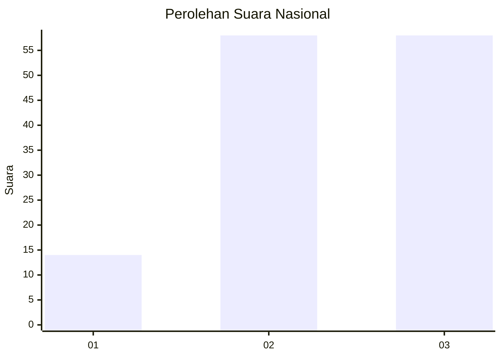
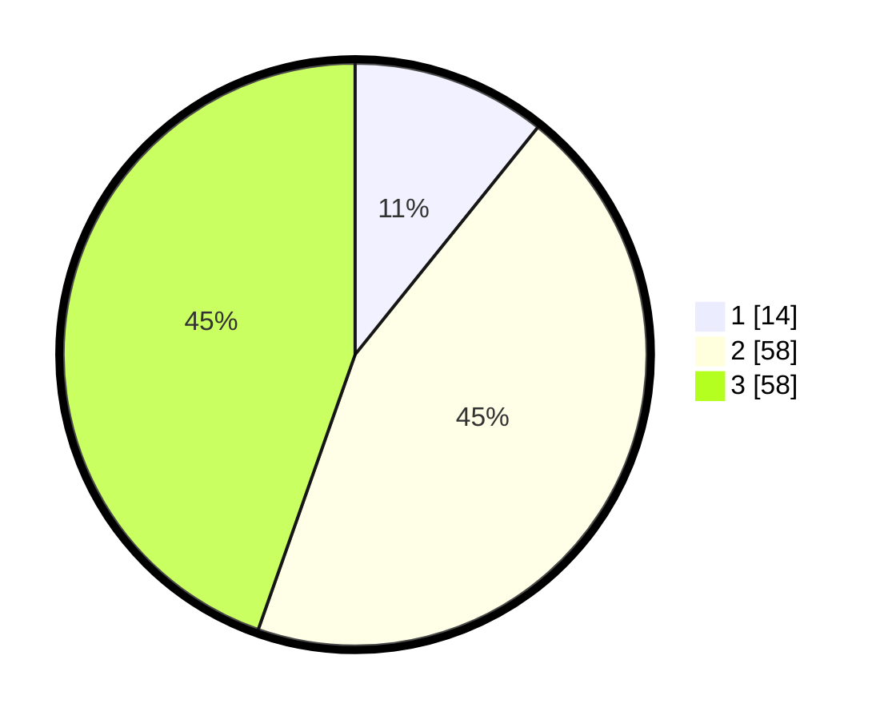

# Hasil

## Grafik

## Tabel

| No. | Nama Paslon    | Suara | Suara (raw) | Persentase |
|:--- |:-------------- | -----:| -----------:| ----------:|
| 1   | ANIES MUHAIMIN | 14    | [14][p-1]   | 10,77      |
| 2   | PRABOWO GIBRAN | 58    | [58][p-2]   | 44,62      |
| 3   | GANJAR MAHFUD  | 58    | [58][p-3]   | 44,62      |

[p-1]: https://github.com/gigit-pemilu/pemilu-2024/blob/main/pilpres/hitung-suara/sub/61-kalimantan-barat/sub/72-kota-singkawang/sub/02-singkawang-barat/sub/1001-pasiran/sub/082-tps/sub/paslon-1.txt
[p-2]: https://github.com/gigit-pemilu/pemilu-2024/blob/main/pilpres/hitung-suara/sub/61-kalimantan-barat/sub/72-kota-singkawang/sub/02-singkawang-barat/sub/1001-pasiran/sub/082-tps/sub/paslon-2.txt
[p-3]: https://github.com/gigit-pemilu/pemilu-2024/blob/main/pilpres/hitung-suara/sub/61-kalimantan-barat/sub/72-kota-singkawang/sub/02-singkawang-barat/sub/1001-pasiran/sub/082-tps/sub/paslon-3.txt

## Foto C Plano

https://sirekap-obj-formc.kpu.go.id/b3f4/pemilu/ppwp/61/72/02/10/01/6172021001082-20240215-014640--5a88014a-b2d3-4e19-8f88-71272a6622cd.jpg

https://sirekap-obj-formc.kpu.go.id/b3f4/pemilu/ppwp/61/72/02/10/01/6172021001082-20240215-014832--b0722f95-993f-4e2f-8114-ea197ede4563.jpg

https://sirekap-obj-formc.kpu.go.id/b3f4/pemilu/ppwp/61/72/02/10/01/6172021001082-20240215-015020--ec510e41-cfb6-4ad1-8144-9db5aab475e1.jpg

## Metadata

| Key        | Value               |
| ---------- | ------------------- |
| Time Stamp | 2024-02-24 22:31:28 |

