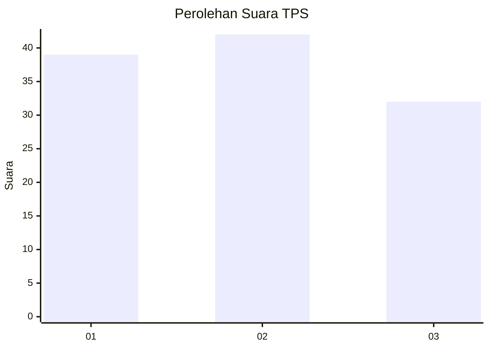
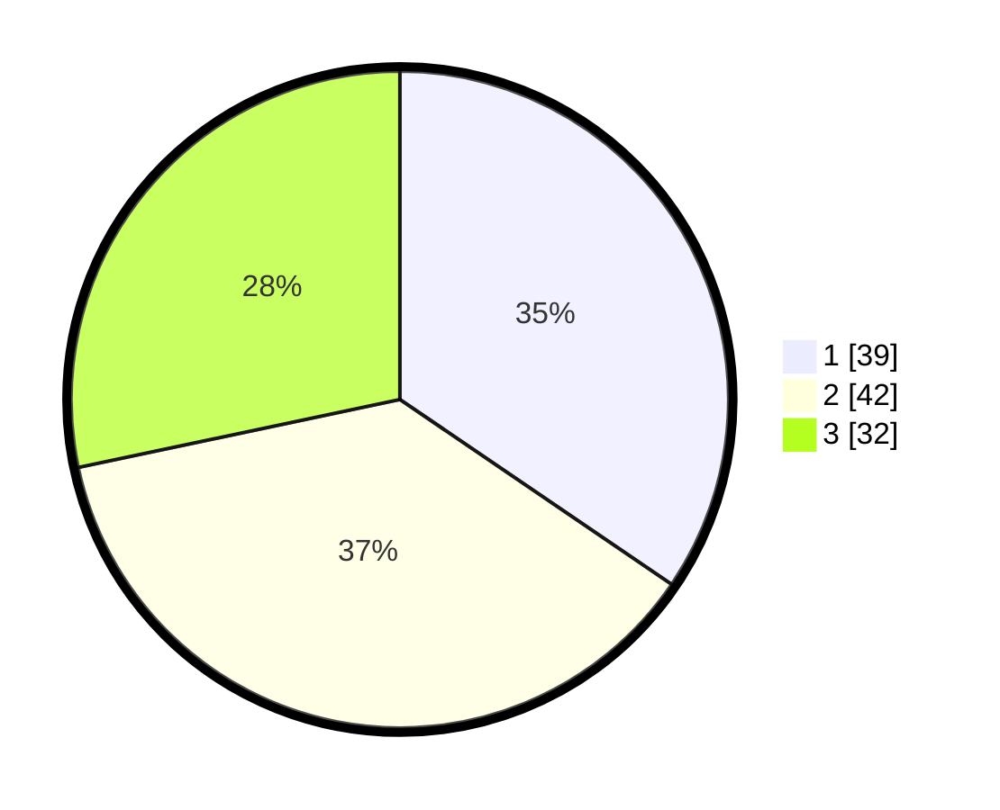

# Hasil

## Grafik

## Tabel

| No. | Nama Paslon    | Suara | Suara (raw) | Persentase |
|:--- |:-------------- | -----:| -----------:| ----------:|
| 1   | ANIES MUHAIMIN | 39    | [39][p-1]   | 34,51      |
| 2   | PRABOWO GIBRAN | 42    | [42][p-2]   | 37,17      |
| 3   | GANJAR MAHFUD  | 32    | [32][p-3]   | 28,32      |

[p-1]: https://github.com/gigit-pemilu/pemilu-2024-61-kalimantan-barat/blob/main/pilpres/hitung-suara/sub/61-kalimantan-barat/sub/72-kota-singkawang/sub/02-singkawang-barat/sub/1001-pasiran/sub/096-tps/sub/paslon-1.txt
[p-2]: https://github.com/gigit-pemilu/pemilu-2024-61-kalimantan-barat/blob/main/pilpres/hitung-suara/sub/61-kalimantan-barat/sub/72-kota-singkawang/sub/02-singkawang-barat/sub/1001-pasiran/sub/096-tps/sub/paslon-2.txt
[p-3]: https://github.com/gigit-pemilu/pemilu-2024-61-kalimantan-barat/blob/main/pilpres/hitung-suara/sub/61-kalimantan-barat/sub/72-kota-singkawang/sub/02-singkawang-barat/sub/1001-pasiran/sub/096-tps/sub/paslon-3.txt

## Foto C Plano

https://sirekap-obj-formc.kpu.go.id/b73e/pemilu/ppwp/61/72/02/10/01/6172021001096-20240228-125609--30ea035e-00a1-43e8-a058-5bc652d80242.jpg

https://sirekap-obj-formc.kpu.go.id/b73e/pemilu/ppwp/61/72/02/10/01/6172021001096-20240214-150956--5489cf84-a3e2-4bcf-bef1-3aa8eeba78fe.jpg

https://sirekap-obj-formc.kpu.go.id/b73e/pemilu/ppwp/61/72/02/10/01/6172021001096-20240214-151012--ea5e7432-a602-4831-80ac-6bff95c284aa.jpg

## Metadata

| Key        | Value               |
| ---------- | ------------------- |
| Time Stamp | 2024-02-28 13:00:00 |

