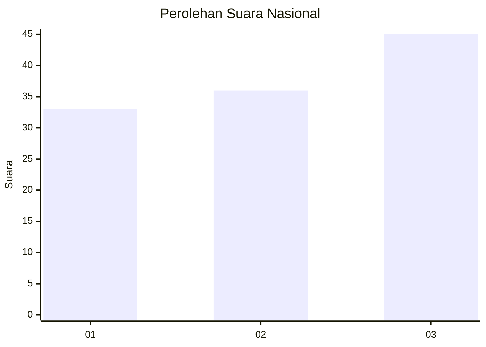
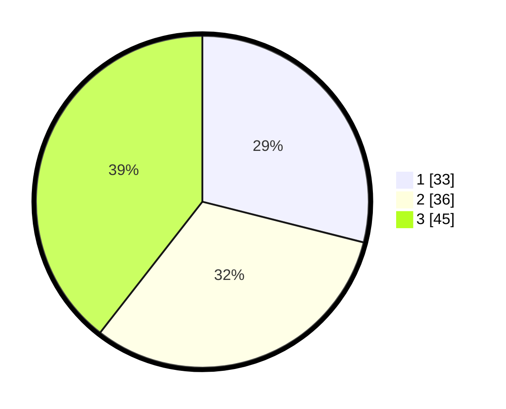

# Hasil

## Grafik

## Tabel

| No. | Nama Paslon    | Suara | Suara (raw) | Persentase |
|:--- |:-------------- | -----:| -----------:| ----------:|
| 1   | ANIES MUHAIMIN | 33    | [33][p-1]   | 28,95      |
| 2   | PRABOWO GIBRAN | 36    | [36][p-2]   | 31,58      |
| 3   | GANJAR MAHFUD  | 45    | [45][p-3]   | 39,47      |

[p-1]: https://github.com/gigit-pemilu/pemilu-2024/blob/main/pilpres/hitung-suara/sub/61-kalimantan-barat/sub/72-kota-singkawang/sub/02-singkawang-barat/sub/1001-pasiran/sub/097-tps/sub/paslon-1.txt
[p-2]: https://github.com/gigit-pemilu/pemilu-2024/blob/main/pilpres/hitung-suara/sub/61-kalimantan-barat/sub/72-kota-singkawang/sub/02-singkawang-barat/sub/1001-pasiran/sub/097-tps/sub/paslon-2.txt
[p-3]: https://github.com/gigit-pemilu/pemilu-2024/blob/main/pilpres/hitung-suara/sub/61-kalimantan-barat/sub/72-kota-singkawang/sub/02-singkawang-barat/sub/1001-pasiran/sub/097-tps/sub/paslon-3.txt

## Foto C Plano

https://sirekap-obj-formc.kpu.go.id/79b5/pemilu/ppwp/61/72/02/10/01/6172021001097-20240214-233134--1048762f-09f3-4a86-b3e3-b3c39e61afd2.jpg

https://sirekap-obj-formc.kpu.go.id/79b5/pemilu/ppwp/61/72/02/10/01/6172021001097-20240214-235414--ccd88650-c8f9-4188-9a4c-c8e137aba222.jpg

https://sirekap-obj-formc.kpu.go.id/79b5/pemilu/ppwp/61/72/02/10/01/6172021001097-20240214-233255--71ae6e74-a054-40e6-a900-91ce94ffc624.jpg

## Metadata

| Key        | Value               |
| ---------- | ------------------- |
| Time Stamp | 2024-02-24 22:31:28 |

