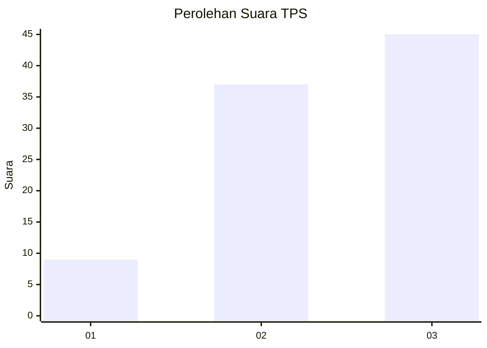
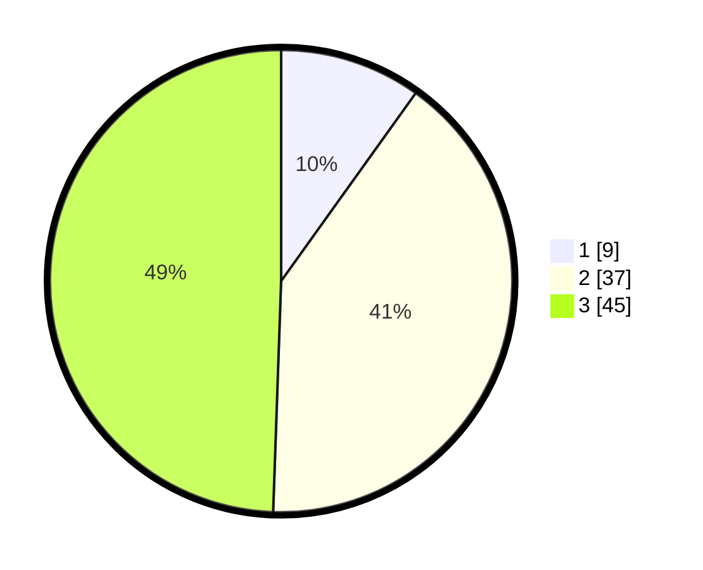

# Hasil

## Grafik

## Tabel

| No. | Nama Paslon    | Suara | Suara (raw) | Persentase |
|:--- |:-------------- | -----:| -----------:| ----------:|
| 1   | ANIES MUHAIMIN | 9     | [9][p-1]    | 9,89       |
| 2   | PRABOWO GIBRAN | 37    | [37][p-2]   | 40,66      |
| 3   | GANJAR MAHFUD  | 45    | [45][p-3]   | 49,45      |

[p-1]: https://github.com/gigit-pemilu/pemilu-2024-61-kalimantan-barat/blob/main/pilpres/hitung-suara/sub/61-kalimantan-barat/sub/72-kota-singkawang/sub/02-singkawang-barat/sub/1002-melayu/sub/028-tps/sub/paslon-1.txt
[p-2]: https://github.com/gigit-pemilu/pemilu-2024-61-kalimantan-barat/blob/main/pilpres/hitung-suara/sub/61-kalimantan-barat/sub/72-kota-singkawang/sub/02-singkawang-barat/sub/1002-melayu/sub/028-tps/sub/paslon-2.txt
[p-3]: https://github.com/gigit-pemilu/pemilu-2024-61-kalimantan-barat/blob/main/pilpres/hitung-suara/sub/61-kalimantan-barat/sub/72-kota-singkawang/sub/02-singkawang-barat/sub/1002-melayu/sub/028-tps/sub/paslon-3.txt

## Foto C Plano

https://sirekap-obj-formc.kpu.go.id/4883/pemilu/ppwp/61/72/02/10/02/6172021002028-20240215-150751--03c145ac-c6cf-48ce-a03b-5647200a6d7a.jpg

https://sirekap-obj-formc.kpu.go.id/4883/pemilu/ppwp/61/72/02/10/02/6172021002028-20240215-150909--109fe296-6a89-4f39-ab1f-dc0bb121c47c.jpg

https://sirekap-obj-formc.kpu.go.id/4883/pemilu/ppwp/61/72/02/10/02/6172021002028-20240215-151035--b8890927-8b05-43a9-bbdb-465d34a1aeef.jpg

## Metadata

| Key        | Value               |
| ---------- | ------------------- |
| Time Stamp | 2024-02-25 16:00:00 |

