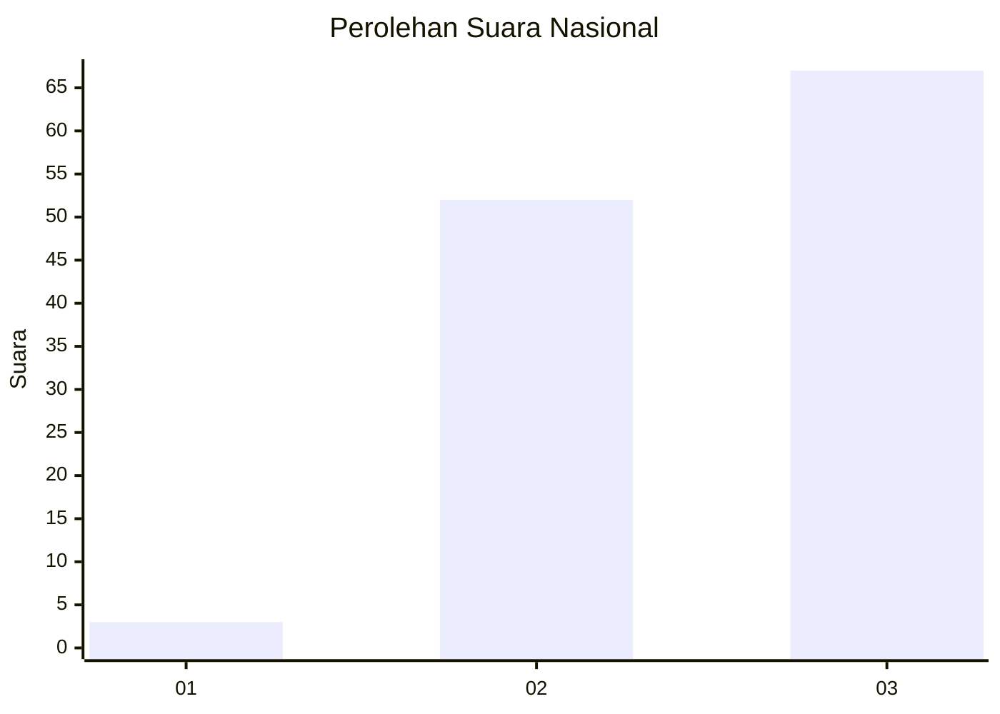
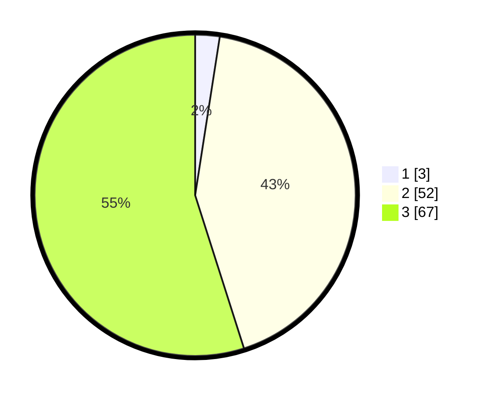

# Hasil

## Grafik

## Tabel

| No. | Nama Paslon    | Suara | Suara (raw) | Persentase |
|:--- |:-------------- | -----:| -----------:| ----------:|
| 1   | ANIES MUHAIMIN | 3     | [3][p-1]    | 2,46       |
| 2   | PRABOWO GIBRAN | 52    | [52][p-2]   | 42,62      |
| 3   | GANJAR MAHFUD  | 67    | [67][p-3]   | 54,92      |

[p-1]: https://github.com/gigit-pemilu/pemilu-2024/blob/main/pilpres/hitung-suara/sub/61-kalimantan-barat/sub/72-kota-singkawang/sub/02-singkawang-barat/sub/1002-melayu/sub/029-tps/sub/paslon-1.txt
[p-2]: https://github.com/gigit-pemilu/pemilu-2024/blob/main/pilpres/hitung-suara/sub/61-kalimantan-barat/sub/72-kota-singkawang/sub/02-singkawang-barat/sub/1002-melayu/sub/029-tps/sub/paslon-2.txt
[p-3]: https://github.com/gigit-pemilu/pemilu-2024/blob/main/pilpres/hitung-suara/sub/61-kalimantan-barat/sub/72-kota-singkawang/sub/02-singkawang-barat/sub/1002-melayu/sub/029-tps/sub/paslon-3.txt

## Foto C Plano

https://sirekap-obj-formc.kpu.go.id/cf6c/pemilu/ppwp/61/72/02/10/02/6172021002029-20240215-035025--974d28c8-90f9-4940-9963-1d0978986d60.jpg

https://sirekap-obj-formc.kpu.go.id/cf6c/pemilu/ppwp/61/72/02/10/02/6172021002029-20240215-035119--8f02f712-3956-4d90-9383-01f9a478bc26.jpg

https://sirekap-obj-formc.kpu.go.id/cf6c/pemilu/ppwp/61/72/02/10/02/6172021002029-20240215-035235--c98de5d5-27e0-4e4a-bd88-0cded0b67862.jpg

## Metadata

| Key        | Value               |
| ---------- | ------------------- |
| Time Stamp | 2024-02-25 13:00:00 |

