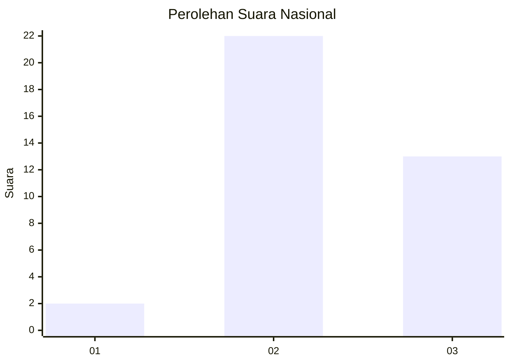
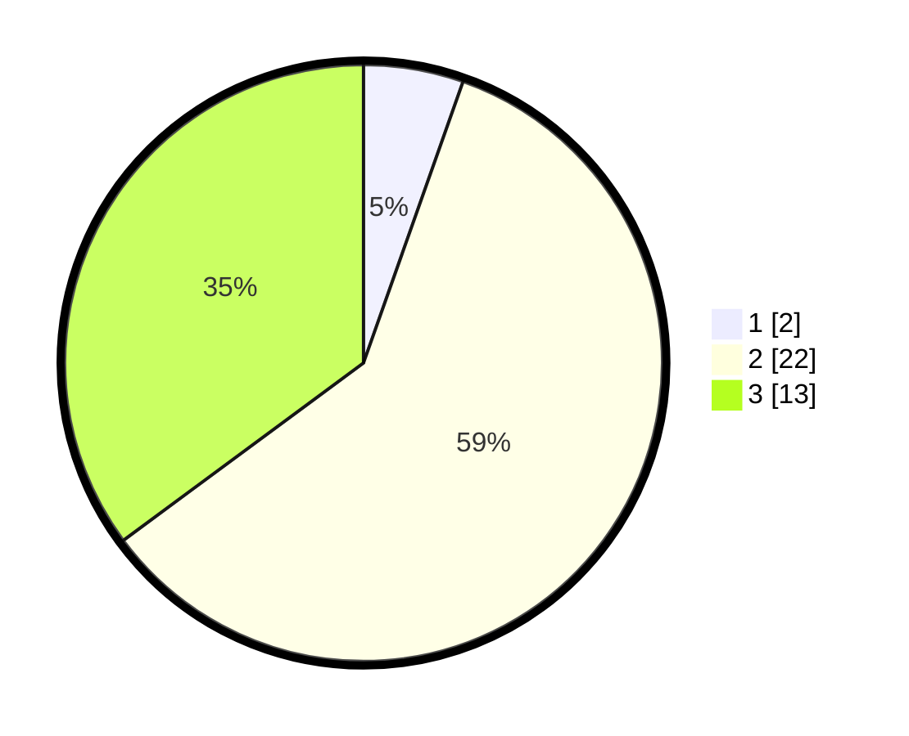

# Hasil

## Grafik

## Tabel

| No. | Nama Paslon    | Suara | Suara (raw) | Persentase |
|:--- |:-------------- | -----:| -----------:| ----------:|
| 1   | ANIES MUHAIMIN | 2     | [2][p-1]    | 5,41       |
| 2   | PRABOWO GIBRAN | 22    | [22][p-2]   | 59,46      |
| 3   | GANJAR MAHFUD  | 13    | [13][p-3]   | 35,14      |

[p-1]: https://github.com/gigit-pemilu/pemilu-2024/blob/main/pilpres/hitung-suara/sub/61-kalimantan-barat/sub/72-kota-singkawang/sub/02-singkawang-barat/sub/1004-kuala/sub/004-tps/sub/paslon-1.txt
[p-2]: https://github.com/gigit-pemilu/pemilu-2024/blob/main/pilpres/hitung-suara/sub/61-kalimantan-barat/sub/72-kota-singkawang/sub/02-singkawang-barat/sub/1004-kuala/sub/004-tps/sub/paslon-2.txt
[p-3]: https://github.com/gigit-pemilu/pemilu-2024/blob/main/pilpres/hitung-suara/sub/61-kalimantan-barat/sub/72-kota-singkawang/sub/02-singkawang-barat/sub/1004-kuala/sub/004-tps/sub/paslon-3.txt

## Foto C Plano

https://sirekap-obj-formc.kpu.go.id/275e/pemilu/ppwp/61/72/02/10/04/6172021004004-20240228-203302--b80e2ce0-017e-4851-99e1-68be3f971b44.jpg

https://sirekap-obj-formc.kpu.go.id/275e/pemilu/ppwp/61/72/02/10/04/6172021004004-20240228-203453--2745a4cb-4004-4a01-bfa1-f5a4b542b83d.jpg

https://sirekap-obj-formc.kpu.go.id/275e/pemilu/ppwp/61/72/02/10/04/6172021004004-20240228-170308--2c154588-00a9-4255-b884-1e3ed31b7dc9.jpg

## Metadata

| Key        | Value               |
| ---------- | ------------------- |
| Time Stamp | 2024-02-28 21:00:00 |

