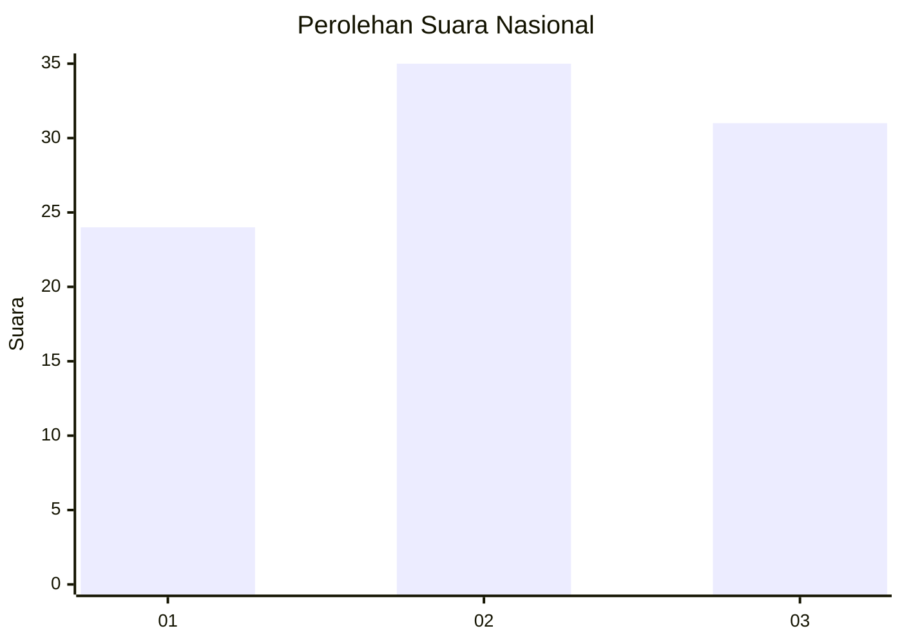
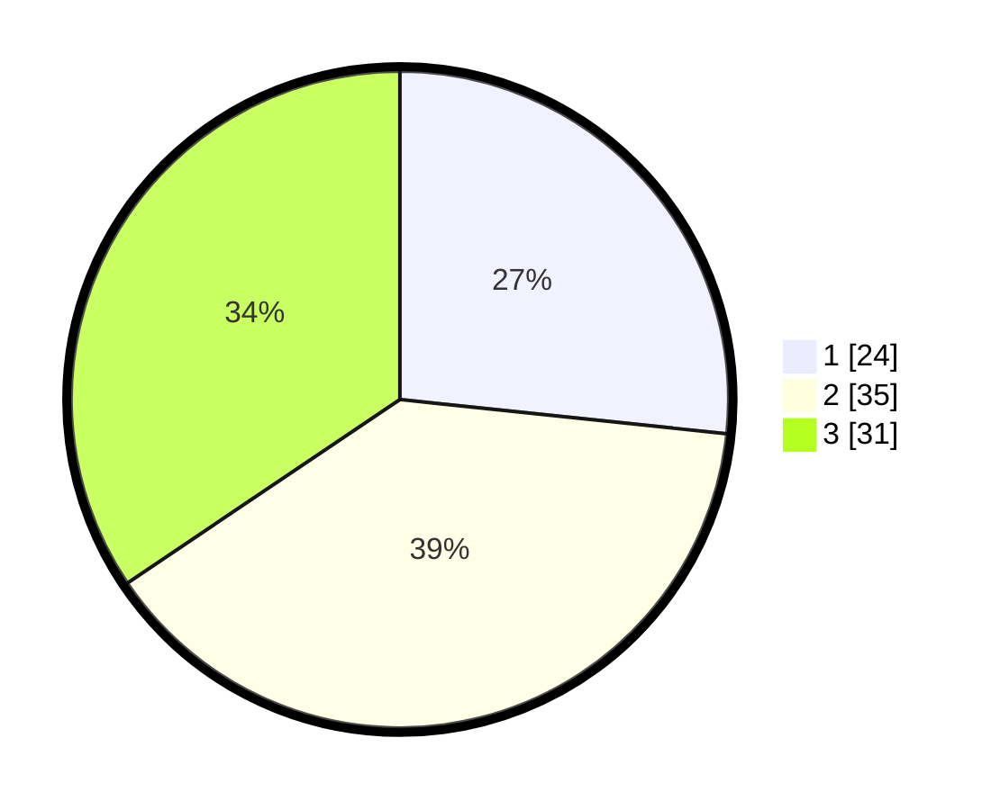

# Hasil

## Grafik

## Tabel

| No. | Nama Paslon    | Suara | Suara (raw) | Persentase |
|:--- |:-------------- | -----:| -----------:| ----------:|
| 1   | ANIES MUHAIMIN | 24    | [24][p-1]   | 26,67      |
| 2   | PRABOWO GIBRAN | 35    | [35][p-2]   | 38,89      |
| 3   | GANJAR MAHFUD  | 31    | [31][p-3]   | 34,44      |

[p-1]: https://github.com/gigit-pemilu/pemilu-2024/blob/main/pilpres/hitung-suara/sub/61-kalimantan-barat/sub/72-kota-singkawang/sub/04-singkawang-utara/sub/1001-sungai-garam-hilir/sub/003-tps/sub/paslon-1.txt
[p-2]: https://github.com/gigit-pemilu/pemilu-2024/blob/main/pilpres/hitung-suara/sub/61-kalimantan-barat/sub/72-kota-singkawang/sub/04-singkawang-utara/sub/1001-sungai-garam-hilir/sub/003-tps/sub/paslon-2.txt
[p-3]: https://github.com/gigit-pemilu/pemilu-2024/blob/main/pilpres/hitung-suara/sub/61-kalimantan-barat/sub/72-kota-singkawang/sub/04-singkawang-utara/sub/1001-sungai-garam-hilir/sub/003-tps/sub/paslon-3.txt

## Foto C Plano

https://sirekap-obj-formc.kpu.go.id/8f79/pemilu/ppwp/61/72/04/10/01/6172041001003-20240214-235158--2d1d99f9-4fd8-4787-9209-14a61dbf07e9.jpg

https://sirekap-obj-formc.kpu.go.id/8f79/pemilu/ppwp/61/72/04/10/01/6172041001003-20240214-235817--9436cb96-7ce9-4462-90d3-a58d039f4aea.jpg

https://sirekap-obj-formc.kpu.go.id/8f79/pemilu/ppwp/61/72/04/10/01/6172041001003-20240214-235934--723f70a8-a5cc-4c94-9ba4-aafcb2545416.jpg

## Metadata

| Key        | Value               |
| ---------- | ------------------- |
| Time Stamp | 2024-02-15 17:30:25 |

## DATA PEMILIH TETAP

Jumlah pemilih dalam DPT: **126**.
 * L: **63**.
 * P: **63**.

## DATA PENGGUNA HAK PILIH

Jumlah pengguna hak pilih dalam DPT: **88**.
 * L: **47**.
 * P: **41**.

Jumlah pengguna hak pilih dalam DPTb: **2**.
 * L: **1**.
 * P: **1**.

Jumlah pengguna hak pilih dalam DPK: **0**.
 * L: **0**.
 * P: **0**.

Jumlah pengguna hak pilih: **90**.
 * L: **48**.
 * P: **42**.

## JUMLAH SUARA SAH DAN TIDAK SAH

JUMLAH SELURUH SUARA SAH: **90**.

JUMLAH SUARA TIDAK SAH: **0**.

JUMLAH SELURUH SUARA SAH DAN SUARA TIDAK SAH: **90**.

