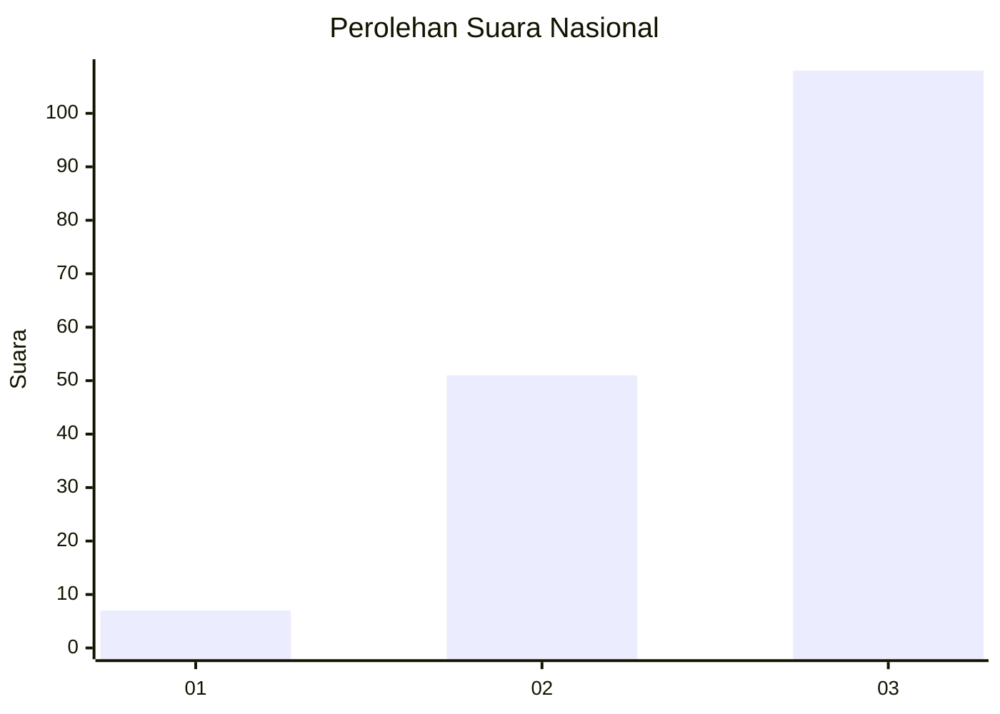
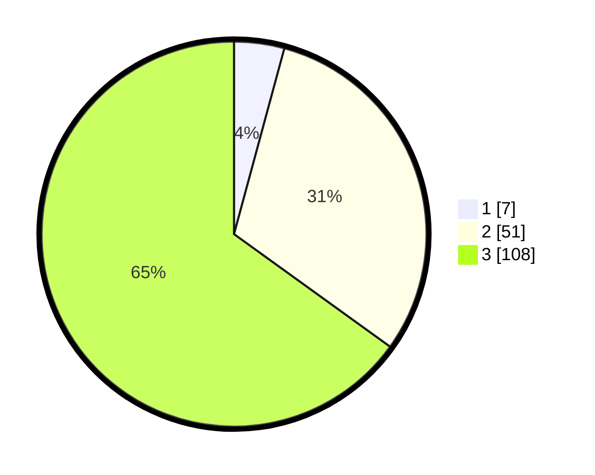

# Hasil

## Grafik

## Tabel

| No. | Nama Paslon    | Suara | Suara (raw) | Persentase |
|:--- |:-------------- | -----:| -----------:| ----------:|
| 1   | ANIES MUHAIMIN | 7     | [7][p-1]    | 4,22       |
| 2   | PRABOWO GIBRAN | 51    | [51][p-2]   | 30,72      |
| 3   | GANJAR MAHFUD  | 108   | [108][p-3]  | 65,06      |

[p-1]: https://github.com/gigit-pemilu/pemilu-2024/blob/main/pilpres/hitung-suara/sub/61-kalimantan-barat/sub/72-kota-singkawang/sub/05-singkawang-selatan/sub/1001-sedau/sub/010-tps/sub/paslon-1.txt
[p-2]: https://github.com/gigit-pemilu/pemilu-2024/blob/main/pilpres/hitung-suara/sub/61-kalimantan-barat/sub/72-kota-singkawang/sub/05-singkawang-selatan/sub/1001-sedau/sub/010-tps/sub/paslon-2.txt
[p-3]: https://github.com/gigit-pemilu/pemilu-2024/blob/main/pilpres/hitung-suara/sub/61-kalimantan-barat/sub/72-kota-singkawang/sub/05-singkawang-selatan/sub/1001-sedau/sub/010-tps/sub/paslon-3.txt

## Foto C Plano

https://sirekap-obj-formc.kpu.go.id/4a4d/pemilu/ppwp/61/72/05/10/01/6172051001010-20240214-233016--62b232a0-e539-4423-ad6d-e10c15be3a0a.jpg

https://sirekap-obj-formc.kpu.go.id/4a4d/pemilu/ppwp/61/72/05/10/01/6172051001010-20240214-233102--bc672a53-d271-4f3a-a5d6-c66cc847e729.jpg

https://sirekap-obj-formc.kpu.go.id/4a4d/pemilu/ppwp/61/72/05/10/01/6172051001010-20240214-233145--8141dc67-fe78-4be2-96e8-c682b1ad0314.jpg

## Metadata

| Key        | Value               |
| ---------- | ------------------- |
| Time Stamp | 2024-02-25 18:00:00 |

