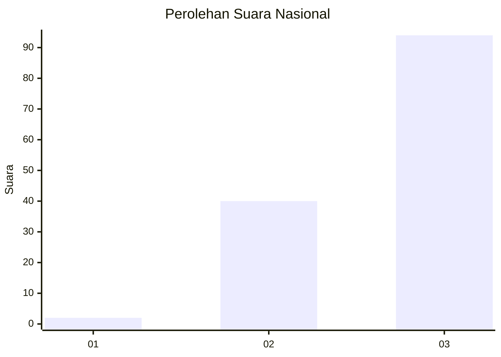
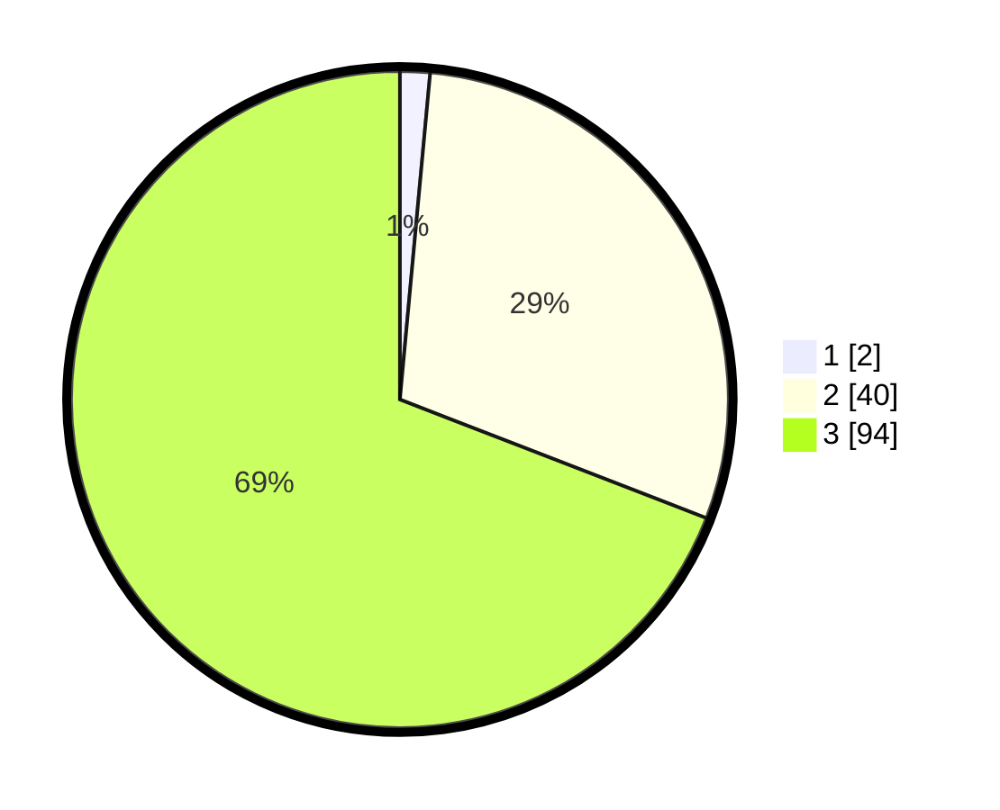

# Hasil

## Grafik

## Tabel

| No. | Nama Paslon    | Suara | Suara (raw) | Persentase |
|:--- |:-------------- | -----:| -----------:| ----------:|
| 1   | ANIES MUHAIMIN | 2     | [2][p-1]    | 1,47       |
| 2   | PRABOWO GIBRAN | 40    | [40][p-2]   | 29,41      |
| 3   | GANJAR MAHFUD  | 94    | [94][p-3]   | 69,12      |

[p-1]: https://github.com/gigit-pemilu/pemilu-2024/blob/main/pilpres/hitung-suara/sub/61-kalimantan-barat/sub/72-kota-singkawang/sub/05-singkawang-selatan/sub/1001-sedau/sub/046-tps/sub/paslon-1.txt
[p-2]: https://github.com/gigit-pemilu/pemilu-2024/blob/main/pilpres/hitung-suara/sub/61-kalimantan-barat/sub/72-kota-singkawang/sub/05-singkawang-selatan/sub/1001-sedau/sub/046-tps/sub/paslon-2.txt
[p-3]: https://github.com/gigit-pemilu/pemilu-2024/blob/main/pilpres/hitung-suara/sub/61-kalimantan-barat/sub/72-kota-singkawang/sub/05-singkawang-selatan/sub/1001-sedau/sub/046-tps/sub/paslon-3.txt

## Foto C Plano

https://sirekap-obj-formc.kpu.go.id/e210/pemilu/ppwp/61/72/05/10/01/6172051001046-20240214-221319--bda586a5-22b7-43a4-9ba7-cefa2bd8206e.jpg

https://sirekap-obj-formc.kpu.go.id/e210/pemilu/ppwp/61/72/05/10/01/6172051001046-20240214-221535--df883712-8749-4615-af29-d9b2993d9d37.jpg

https://sirekap-obj-formc.kpu.go.id/e210/pemilu/ppwp/61/72/05/10/01/6172051001046-20240214-221825--40a84268-5862-442c-bff1-116ba5d8a6d7.jpg

## Metadata

| Key        | Value               |
| ---------- | ------------------- |
| Time Stamp | 2024-02-24 22:31:28 |

