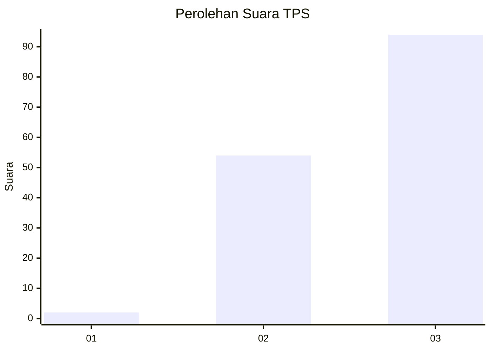
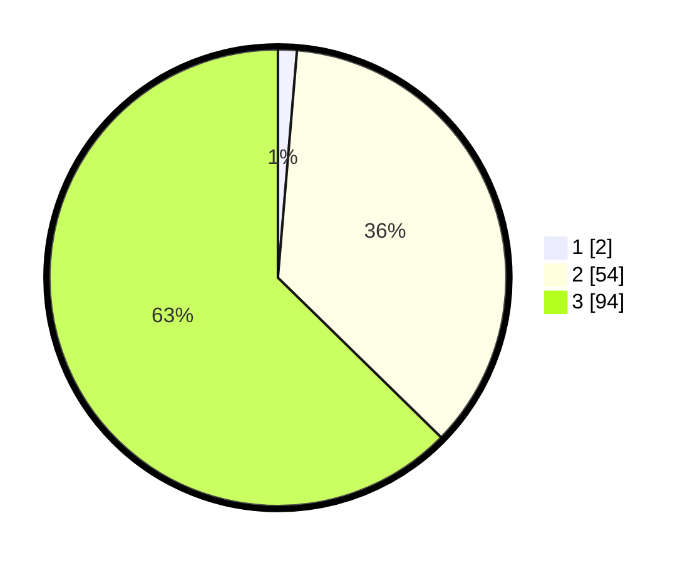

# Hasil

## Grafik

## Tabel

| No. | Nama Paslon    | Suara | Suara (raw) | Persentase |
|:--- |:-------------- | -----:| -----------:| ----------:|
| 1   | ANIES MUHAIMIN | 2     | [2][p-1]    | 1,33       |
| 2   | PRABOWO GIBRAN | 54    | [54][p-2]   | 36,00      |
| 3   | GANJAR MAHFUD  | 94    | [94][p-3]   | 62,67      |

[p-1]: https://github.com/gigit-pemilu/pemilu-2024-61-kalimantan-barat/blob/main/pilpres/hitung-suara/sub/61-kalimantan-barat/sub/72-kota-singkawang/sub/05-singkawang-selatan/sub/1001-sedau/sub/073-tps/sub/paslon-1.txt
[p-2]: https://github.com/gigit-pemilu/pemilu-2024-61-kalimantan-barat/blob/main/pilpres/hitung-suara/sub/61-kalimantan-barat/sub/72-kota-singkawang/sub/05-singkawang-selatan/sub/1001-sedau/sub/073-tps/sub/paslon-2.txt
[p-3]: https://github.com/gigit-pemilu/pemilu-2024-61-kalimantan-barat/blob/main/pilpres/hitung-suara/sub/61-kalimantan-barat/sub/72-kota-singkawang/sub/05-singkawang-selatan/sub/1001-sedau/sub/073-tps/sub/paslon-3.txt

## Foto C Plano

https://sirekap-obj-formc.kpu.go.id/eb89/pemilu/ppwp/61/72/05/10/01/6172051001073-20240214-220326--ba05e221-b8df-455d-8fc7-9a759f4f228e.jpg

https://sirekap-obj-formc.kpu.go.id/eb89/pemilu/ppwp/61/72/05/10/01/6172051001073-20240214-220349--7ad0b2cb-2498-4179-982d-4f19417796f4.jpg

https://sirekap-obj-formc.kpu.go.id/eb89/pemilu/ppwp/61/72/05/10/01/6172051001073-20240214-220403--1c7f9eb5-be10-4623-8e78-eae60f77002a.jpg

## Metadata

| Key        | Value               |
| ---------- | ------------------- |
| Time Stamp | 2024-02-24 22:31:28 |

