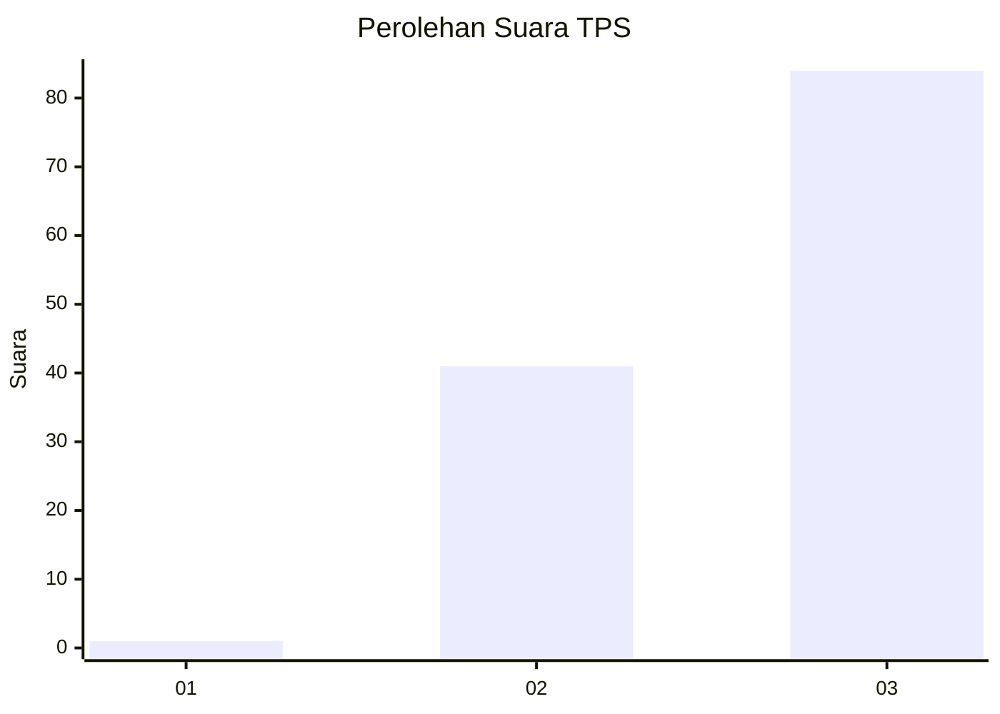
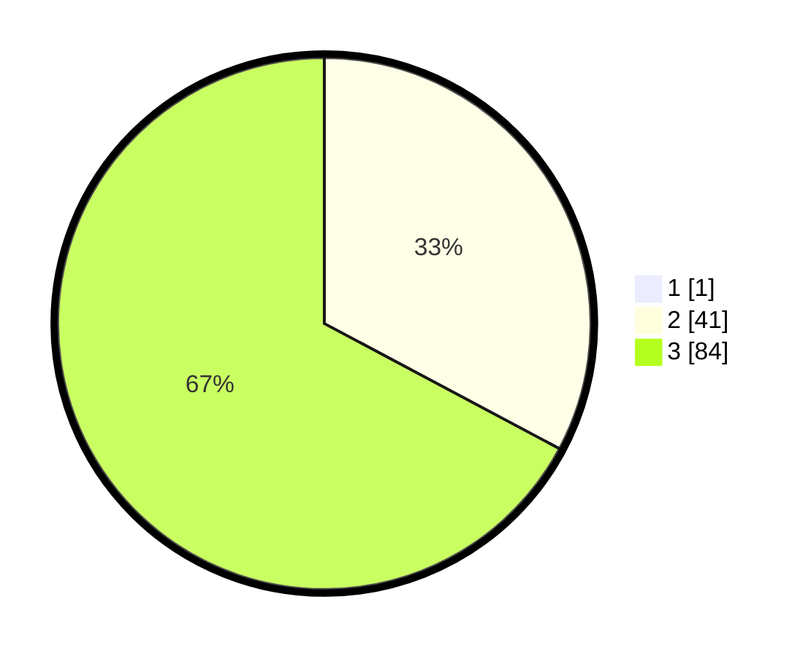

# Hasil

## Grafik

## Tabel

| No. | Nama Paslon    | Suara | Suara (raw) | Persentase |
|:--- |:-------------- | -----:| -----------:| ----------:|
| 1   | ANIES MUHAIMIN | 1     | [1][p-1]    | 0,79       |
| 2   | PRABOWO GIBRAN | 41    | [41][p-2]   | 32,54      |
| 3   | GANJAR MAHFUD  | 84    | [84][p-3]   | 66,67      |

[p-1]: https://github.com/gigit-pemilu/pemilu-2024-61-kalimantan-barat/blob/main/pilpres/hitung-suara/sub/61-kalimantan-barat/sub/72-kota-singkawang/sub/05-singkawang-selatan/sub/1001-sedau/sub/080-tps/sub/paslon-1.txt
[p-2]: https://github.com/gigit-pemilu/pemilu-2024-61-kalimantan-barat/blob/main/pilpres/hitung-suara/sub/61-kalimantan-barat/sub/72-kota-singkawang/sub/05-singkawang-selatan/sub/1001-sedau/sub/080-tps/sub/paslon-2.txt
[p-3]: https://github.com/gigit-pemilu/pemilu-2024-61-kalimantan-barat/blob/main/pilpres/hitung-suara/sub/61-kalimantan-barat/sub/72-kota-singkawang/sub/05-singkawang-selatan/sub/1001-sedau/sub/080-tps/sub/paslon-3.txt

## Foto C Plano

https://sirekap-obj-formc.kpu.go.id/29e2/pemilu/ppwp/61/72/05/10/01/6172051001080-20240214-234759--73c9df02-5fd7-4439-8f78-3d7b62a44db4.jpg

https://sirekap-obj-formc.kpu.go.id/29e2/pemilu/ppwp/61/72/05/10/01/6172051001080-20240214-232837--5fca7dae-4146-421c-be50-4b8a9a8e8d91.jpg

https://sirekap-obj-formc.kpu.go.id/29e2/pemilu/ppwp/61/72/05/10/01/6172051001080-20240214-232838--3b8b0cdb-f92e-41ec-8413-4e32783355ea.jpg

## Metadata

| Key        | Value               |
| ---------- | ------------------- |
| Time Stamp | 2024-02-25 18:00:00 |

