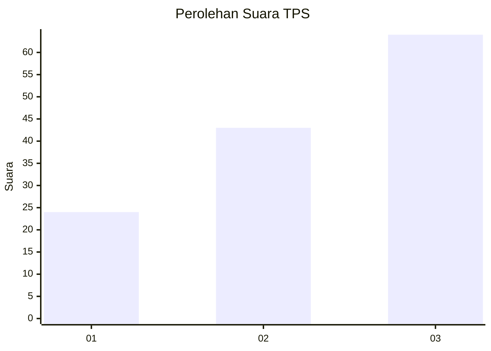
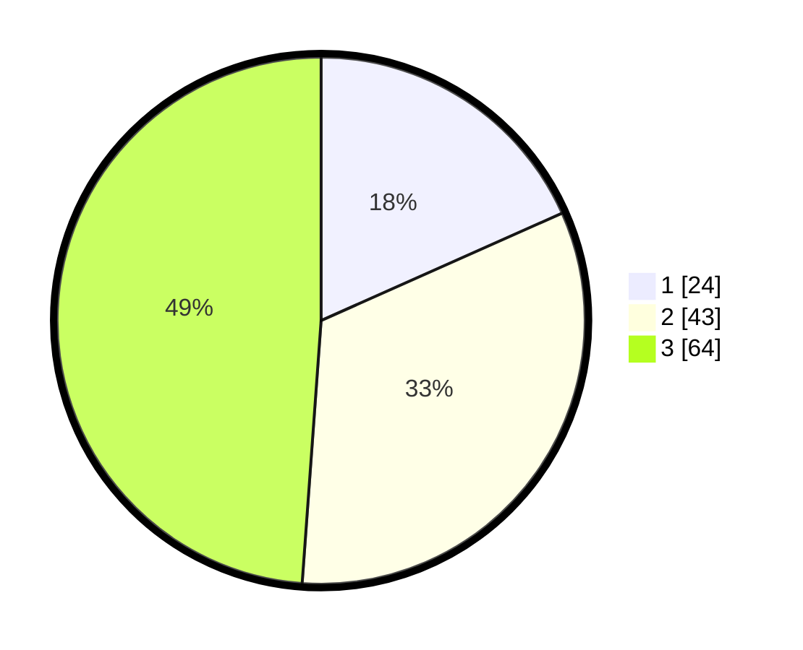

# Hasil

## Grafik

## Tabel

| No. | Nama Paslon    | Suara | Suara (raw) | Persentase |
|:--- |:-------------- | -----:| -----------:| ----------:|
| 1   | ANIES MUHAIMIN | 24    | [24][p-1]   | 18,32      |
| 2   | PRABOWO GIBRAN | 43    | [43][p-2]   | 32,82      |
| 3   | GANJAR MAHFUD  | 64    | [64][p-3]   | 48,85      |

[p-1]: https://github.com/gigit-pemilu/pemilu-2024-61-kalimantan-barat/blob/main/pilpres/hitung-suara/sub/61-kalimantan-barat/sub/72-kota-singkawang/sub/05-singkawang-selatan/sub/1001-sedau/sub/082-tps/sub/paslon-1.txt
[p-2]: https://github.com/gigit-pemilu/pemilu-2024-61-kalimantan-barat/blob/main/pilpres/hitung-suara/sub/61-kalimantan-barat/sub/72-kota-singkawang/sub/05-singkawang-selatan/sub/1001-sedau/sub/082-tps/sub/paslon-2.txt
[p-3]: https://github.com/gigit-pemilu/pemilu-2024-61-kalimantan-barat/blob/main/pilpres/hitung-suara/sub/61-kalimantan-barat/sub/72-kota-singkawang/sub/05-singkawang-selatan/sub/1001-sedau/sub/082-tps/sub/paslon-3.txt

## Foto C Plano

https://sirekap-obj-formc.kpu.go.id/1ef9/pemilu/ppwp/61/72/05/10/01/6172051001082-20240214-214554--07e2dd6e-0343-4646-a4b0-73aeaf4e4b80.jpg

https://sirekap-obj-formc.kpu.go.id/1ef9/pemilu/ppwp/61/72/05/10/01/6172051001082-20240214-223132--2137d2e4-7d57-4eb8-9ef7-309660f832b0.jpg

https://sirekap-obj-formc.kpu.go.id/1ef9/pemilu/ppwp/61/72/05/10/01/6172051001082-20240215-021444--0ce1faa1-0b14-4a46-a683-15a47319f9e1.jpg

## Metadata

| Key        | Value               |
| ---------- | ------------------- |
| Time Stamp | 2024-02-25 16:00:00 |

