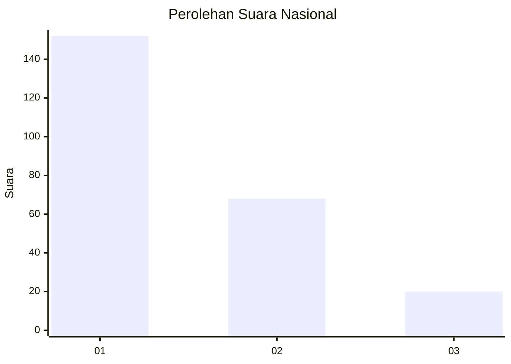
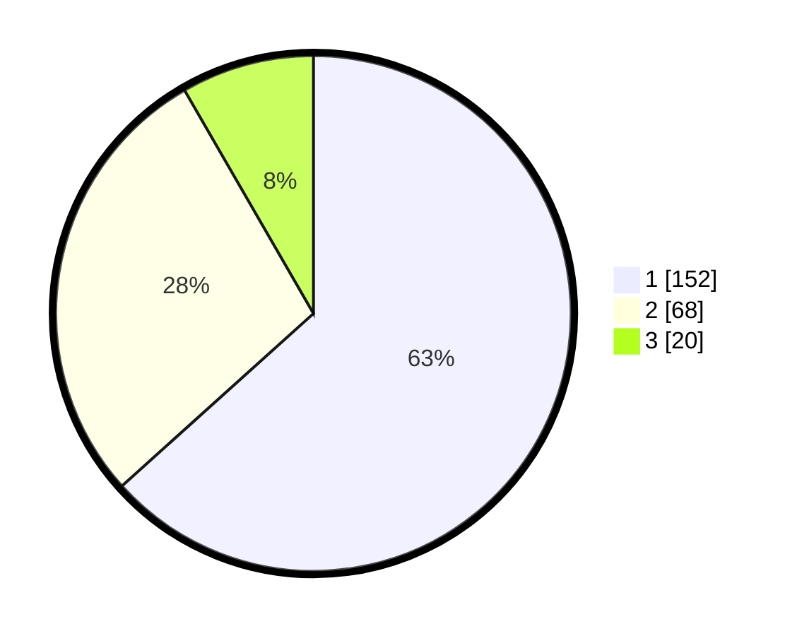

# Hasil

## Grafik

## Tabel

| No. | Nama Paslon    | Suara | Suara (raw) | Persentase |
|:--- |:-------------- | -----:| -----------:| ----------:|
| 1   | ANIES MUHAIMIN | 152   | [152][p-1]  | 63,33      |
| 2   | PRABOWO GIBRAN | 68    | [68][p-2]   | 28,33      |
| 3   | GANJAR MAHFUD  | 20    | [20][p-3]   | 8,33       |

[p-1]: https://github.com/gigit-pemilu/pemilu-2024/blob/main/pilpres/hitung-suara/sub/61-kalimantan-barat/sub/72-kota-singkawang/sub/05-singkawang-selatan/sub/1001-sedau/sub/084-tps/sub/paslon-1.txt
[p-2]: https://github.com/gigit-pemilu/pemilu-2024/blob/main/pilpres/hitung-suara/sub/61-kalimantan-barat/sub/72-kota-singkawang/sub/05-singkawang-selatan/sub/1001-sedau/sub/084-tps/sub/paslon-2.txt
[p-3]: https://github.com/gigit-pemilu/pemilu-2024/blob/main/pilpres/hitung-suara/sub/61-kalimantan-barat/sub/72-kota-singkawang/sub/05-singkawang-selatan/sub/1001-sedau/sub/084-tps/sub/paslon-3.txt

## Foto C Plano

https://sirekap-obj-formc.kpu.go.id/a02a/pemilu/ppwp/61/72/05/10/01/6172051001084-20240214-205804--1d8fbafb-d7a2-4bd5-b365-d1f09c667a96.jpg

https://sirekap-obj-formc.kpu.go.id/a02a/pemilu/ppwp/61/72/05/10/01/6172051001084-20240214-205855--2ffe3f6f-e543-43ea-90c0-545ba4989b66.jpg

https://sirekap-obj-formc.kpu.go.id/a02a/pemilu/ppwp/61/72/05/10/01/6172051001084-20240214-210037--e100e130-651e-4551-8cc1-14e0bdf94683.jpg

## Metadata

| Key        | Value               |
| ---------- | ------------------- |
| Time Stamp | 2024-02-24 22:31:28 |

